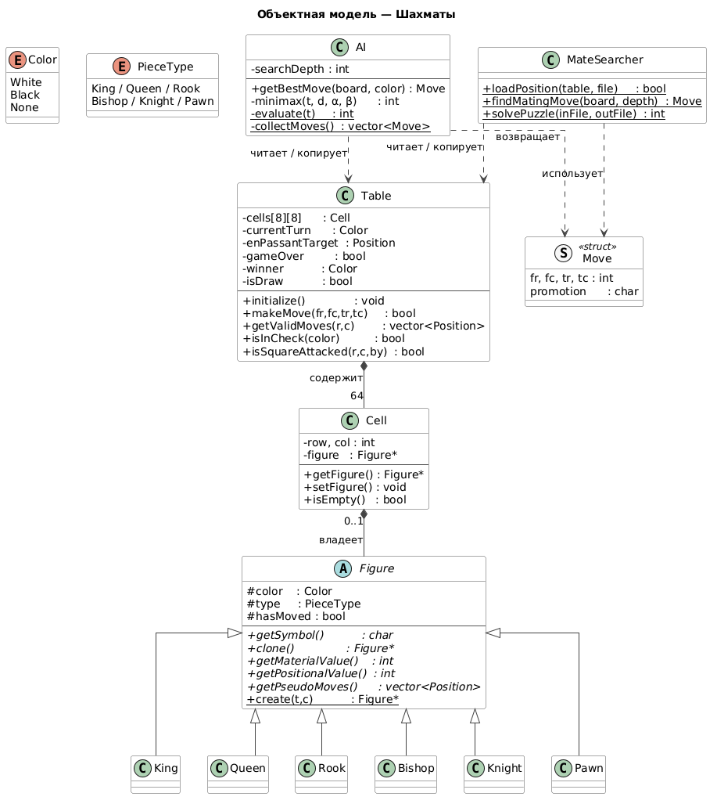
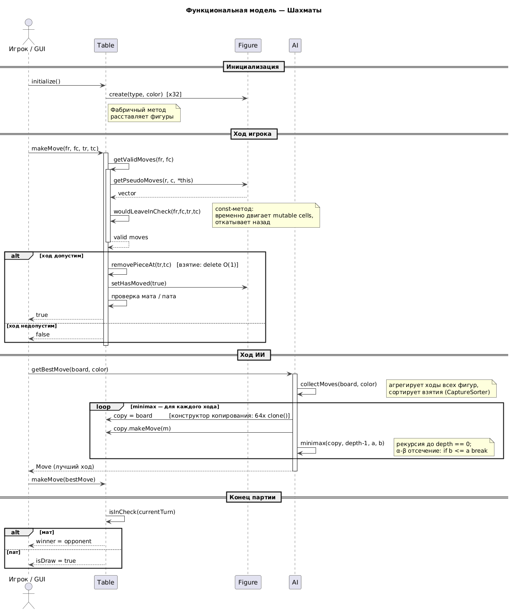

# Пояснительная записка — Шахматный движок

**Интерфейс:** консоль (`main.cpp`) + Python GUI (`chess_bridge.cpp`)  
**Файлы:** `figures.h/cpp`, `cell.h`, `table.h/cpp`, `ai.h/cpp`, `mate_searcher.h/cpp`, `chess_bridge.cpp`, `main.cpp`

---

## 1. Объектная модель



**Ключевые архитектурные решения:**

- `Table` — единственный владелец всех `Figure*` через массив `cells[8][8]`. `Cell` хранит указатель, но не вызывает `delete`.
- `Figure` — абстрактный базовый класс; конкретные фигуры создаются через фабричный метод `Figure::create()`.
- `clone()` — виртуальный конструктор копирования; используется в конструкторе копирования `Table` (64 вызова на каждый узел минимакса).
- `wouldLeaveInCheck` объявлен `const`, но временно переставляет указатели — поле `cells` помечено `mutable`.
- `CaptureSorter` — функтор с `operator()` для сортировки ходов перед α-β поиском.

---

## 2. Функциональная модель



---

## 3. Документация

### 3.1 `struct Color` / `struct PieceType`

**Файл:** `figures.h`

Вложенные `enum` внутри `struct` для создания пространства имён. Значения доступны как `Color::White`, `Color::Black`, `Color::None` и `PieceType::King`, `PieceType::Queen`, `PieceType::Rook`, `PieceType::Bishop`, `PieceType::Knight`, `PieceType::Pawn`, `PieceType::None`.

---

### 3.2 `typedef std::pair<int,int> Position`

**Файл:** `figures.h`

Координаты клетки: `.first` = строка (0–7, 0 = ряд 1), `.second` = столбец (0–7, 0 = столбец a).

---

### 3.3 `class Figure` (абстрактный)

**Файл:** `figures.h / figures.cpp`

Абстрактный базовый класс для всех шахматных фигур. Нельзя создать напрямую — только через `Figure::create()` или конкретных наследников.

#### Конструктор

```cpp
Figure(Color::E c, PieceType::E t)
```
Инициализирует цвет, тип и `hasMoved = false`.

#### Публичные методы

| Сигнатура | Описание |
|-----------|----------|
| `Color::E getColor() const` | Возвращает цвет фигуры (`White` / `Black`). |
| `PieceType::E getType() const` | Возвращает тип фигуры. |
| `bool getHasMoved() const` | Возвращает `true` если фигура уже ходила (нужно для рокировки и двойного хода пешки). |
| `void setHasMoved(bool v)` | Устанавливает флаг «фигура ходила». |
| `virtual char getSymbol() const = 0` | Возвращает символ фигуры: заглавный для белых (`K Q R B N P`), строчный для чёрных (`k q r b n p`). |
| `virtual Figure* clone() const = 0` | Виртуальный конструктор копирования: создаёт точную копию фигуры, зная только `Figure*`. Используется в `Table::Table(const Table&)`. |
| `virtual int getMaterialValue() const = 0` | Материальная ценность фигуры: Пешка=100, Конь=320, Слон=330, Ладья=500, Ферзь=900, Король=20000. |
| `virtual int getPositionalValue(int row, int col) const = 0` | Позиционный бонус из piece-square table (PST). Диапазон −50..+50. |
| `virtual std::vector<Position> getPseudoMoves(int r, int c, const Table& t) const = 0` | Возвращает псевдолегальные ходы (без проверки шаха). Фильтрацию выполняет `Table::getValidMoves`. |
| `static Figure* create(PieceType::E t, Color::E c)` | Фабричный метод: создаёт нужного наследника по типу и цвету. Возвращает `NULL` для `PieceType::None`. |

---

### 3.4 Конкретные фигуры

**Файл:** `figures.h / figures.cpp`

Все наследуют `Figure` и реализуют все чистые виртуальные методы.

| Класс | Конструктор | `getMaterialValue()` | Особенности `getPseudoMoves` |
|-------|-------------|----------------------|------------------------------|
| `King` | `explicit King(Color::E c)` | 20000 | Ходы на 1 клетку в 8 направлениях + рокировка (короткая / длинная): король и ладья не ходили, путь свободен, клетки не под атакой. |
| `Queen` | `explicit Queen(Color::E c)` | 900 | Ходы по всем 8 направлениям до препятствия. |
| `Rook` | `explicit Rook(Color::E c)` | 500 | Ходы по горизонтали и вертикали до препятствия. |
| `Bishop` | `explicit Bishop(Color::E c)` | 330 | Ходы по диагоналям до препятствия. |
| `Knight` | `explicit Knight(Color::E c)` | 320 | Прыжки буквой «Г» (8 вариантов), игнорируют фигуры на пути. |
| `Pawn` | `explicit Pawn(Color::E c)` | 100 | Ход вперёд на 1 (или 2 с начальной позиции), взятие по диагонали, взятие на проходе по `Table::getEnPassantTarget()`. |

---

### 3.5 `class Cell`

**Файл:** `cell.h`

Клетка доски. Хранит координаты и указатель на фигуру. **Не владеет** фигурой — `delete` не вызывает. Удаление фигур — ответственность `Table`.

#### Конструкторы

```cpp
Cell()              // row=0, col=0, figure=NULL
Cell(int r, int c)  // row=r, col=c, figure=NULL
```

#### Публичные методы

| Сигнатура | Описание |
|-----------|----------|
| `Figure* getFigure() const` | Возвращает указатель на фигуру или `NULL`. |
| `void setFigure(Figure* f)` | Устанавливает указатель на фигуру (не удаляет предыдущую). |
| `bool isEmpty() const` | Возвращает `true` если `figure == NULL`. |
| `int getRow() const` | Строка клетки (0–7). |
| `int getCol() const` | Столбец клетки (0–7). |

---

### 3.6 `class Table`

**Файл:** `table.h / table.cpp`

Шахматная доска. Единственный владелец всех `Figure*`. Хранит полное состояние партии.

#### Конструкторы и деструктор

```cpp
Table()
```
Создаёт пустую доску. Ход белых, `enPassantTarget = (-1,-1)`, `gameOver = false`.

```cpp
Table(const Table& other)
```
Глубокое копирование: для каждой занятой клетки вызывает `orig->clone()`. Используется в каждом узле минимакса.

```cpp
~Table()
```
Удаляет все фигуры через `delete`.

#### Публичные методы

| Сигнатура | Описание |
|-----------|----------|
| `void initialize()` | Расставляет стандартную начальную позицию. Сбрасывает `currentTurn`, `enPassantTarget`, `gameOver`, `winner`, `isDraw`. |
| `void clearBoard()` | Удаляет все фигуры, сбрасывает состояние партии. |
| `void placePiece(PieceType::E t, Color::E c, int row, int col)` | Создаёт фигуру типа `t` цвета `c` на клетке `(row, col)`. Некорректные координаты игнорируются. |
| `void display() const` | Выводит позицию в консоль в ASCII-виде с координатами (a–h, 1–8). |
| `Figure* getFigureAt(int r, int c) const` | Фигура на `(r, c)` или `NULL`. Возвращает `NULL` для координат вне доски. |
| `bool isInBounds(int r, int c) const` | `true` если `0 ≤ r < 8` и `0 ≤ c < 8`. |
| `Position getEnPassantTarget() const` | Клетка для взятия на проходе или `(-1,-1)`. |
| `bool isSquareAttacked(int r, int c, Color::E byColor) const` | `true` если `(r, c)` атакована хотя бы одной фигурой цвета `byColor`. |
| `bool isInCheck(Color::E color) const` | `true` если король цвета `color` под шахом. |
| `std::vector<Position> getValidMoves(int r, int c) const` | Все легальные ходы фигуры на `(r, c)`. Отфильтровывает ходы, оставляющие своего короля под шахом. |
| `bool makeMove(int fr, int fc, int tr, int tc, PieceType::E promotion = PieceType::Queen)` | Выполняет ход. Обрабатывает взятие на проходе, рокировку, превращение пешки. После хода проверяет мат/пат. Возвращает `false` если ход нелегален. |
| `Color::E getCurrentTurn() const` | Цвет игрока, чей сейчас ход. |
| `bool isGameOver() const` | `true` если партия завершена (мат или пат). |
| `Color::E getWinner() const` | Победитель или `Color::None`. |
| `bool getIsDraw() const` | `true` при пате. |

---

### 3.7 `struct Move`

**Файл:** `ai.h`

| Поле | Тип | Описание |
|------|-----|----------|
| `fr` | `int` | Строка исходной клетки, 0–7. |
| `fc` | `int` | Столбец исходной клетки, 0–7. |
| `tr` | `int` | Строка целевой клетки, 0–7. |
| `tc` | `int` | Столбец целевой клетки, 0–7. |
| `promotion` | `char` | `'Q'/'R'/'B'/'N'` при превращении пешки. `fr == -1` означает «ход не найден». |

---

### 3.8 `class AI`

**Файл:** `ai.h / ai.cpp`

ИИ на основе минимакса с альфа-бета отсечением. Оценочная функция: материал + позиционные таблицы (PST).

#### Конструктор

```cpp
explicit AI(int searchDepth = 3)
```
`searchDepth` — глубина поиска в полуходах.

#### Публичные методы

| Сигнатура | Описание |
|-----------|----------|
| `Move getBestMove(const Table& board, Color::E color) const` | Лучший ход для `color` на доске `board`. Перебирает все ходы, запускает `minimax` глубиной `searchDepth-1` для каждого. При отсутствии ходов возвращает `Move` с `fr == -1`. |

#### Приватные методы

| Сигнатура | Описание |
|-----------|----------|
| `static int evaluate(const Table& t)` | Оценка позиции: `+v` за белую фигуру, `−v` за чёрную, `v = getMaterialValue() + getPositionalValue()`. |
| `static std::vector<Move> collectMoves(const Table& t, Color::E color)` | Все легальные ходы цвета `color`. Превращение пешки раскрывается в 4 хода. Взятия сортируются первыми через `CaptureSorter`. |
| `static PieceType::E charToPromo(char p)` | `'Q'/'R'/'B'/'N'` → `PieceType::E`. По умолчанию → `Queen`. |
| `int minimax(const Table& t, int depth, int alpha, int beta) const` | Рекурсивный минимакс. Базовые случаи: `depth == 0` → `evaluate`; `isGameOver()` → ±100000. Отсечение: `break` при `beta <= alpha`. |

---

### 3.9 `class MateSearcher`

**Файл:** `mate_searcher.h / mate_searcher.cpp`

Решает задачи «мат в N ходов». Все методы статические. Гарантирует форсированный мат при **всех** ответах соперника.

#### Публичные статические методы

| Сигнатура | Описание |
|-----------|----------|
| `static bool loadPosition(Table& table, const std::string& filename)` | Загружает позицию из файла. Формат: `White:\nKE1\nQA4\nBlack:\nKD8`. Возвращает `false` если файл не открылся. |
| `static Move findMatingMove(const Table& board, int maxDepth)` | Форсированный мат за ≤ `maxDepth` ходов (проверяет мат в 1, затем в 2). `Move` с `fr == -1` если не найден. |
| `static int solvePuzzle(const std::string& inputFile, const std::string& outputFile)` | Загружает позицию, ищет мат, записывает решение в `outputFile`. Возвращает `1`, `2` или `0`. |

#### Приватные статические методы

| Сигнатура | Описание |
|-----------|----------|
| `static bool mateIn1(const Table& t, Move& out)` | Ищет ход белых с немедленным матом. |
| `static bool mateIn2(const Table& t, Move& out)` | Ищет ход белых, после которого **все** ответы чёрных ведут к `mateIn1`. |
| `static std::vector<Move> collectMoves(const Table& t, Color::E color)` | Все легальные ходы цвета `color` (без сортировки). |
| `static PieceType::E charToPromo(char p)` | Символ превращения → тип фигуры. |
| `static std::string squareStr(int r, int c)` | `(0, 4)` → `"e1"`. |
| `static std::string moveStr(const Table& t, const Move& m)` | Ход в нотации: `"Qd5-d8"`, `"Nc4xe5"`, `"Pe7-e8=Q"`. |

---

### 3.10 C API (`chess_bridge.cpp`)

**Файл:** `chess_bridge.cpp`

Обёртка с C-совместимым именованием (`extern "C"`). Python взаимодействует с движком через `ctypes.CDLL`. Доска передаётся как непрозрачный указатель `void*` (`Table*`).

| Сигнатура | Описание |
|-----------|----------|
| `void* chess_create()` | Создаёт доску с начальной позицией. Освобождать через `chess_destroy`. |
| `void chess_destroy(void* handle)` | Удаляет доску и все фигуры. |
| `void chess_reset(void* handle)` | Сброс к начальной позиции. |
| `void chess_get_board(void* handle, char* out)` | Состояние доски: строка 64 символа + `'\0'`, индекс `row*8+col`. Белые: `KQRBNP`, чёрные: `kqrbnp`, пусто: `'.'`. |
| `char chess_get_turn(void* handle)` | `'W'` или `'B'`. |
| `int chess_is_game_over(void* handle)` | `1` если партия завершена. |
| `int chess_is_draw(void* handle)` | `1` при пате. |
| `char chess_get_winner(void* handle)` | `'W'`, `'B'` или `'N'`. |
| `int chess_is_in_check(void* handle, char color)` | `1` если игрок `color` под шахом. |
| `int chess_get_valid_moves(void* handle, int r, int c, int* positions)` | Заполняет `positions` парами `[row, col]`. Возвращает количество ходов. |
| `int chess_make_move(void* handle, int fr, int fc, int tr, int tc, char promotion)` | Выполняет ход. Возвращает `1` при успехе. |
| `int chess_get_best_move(void* handle, char color, int depth, int* out)` | Минимакс глубины `depth`. `out[5]`: fr, fc, tr, tc, promotion(ASCII). Возвращает `1` если ход найден. |
| `int chess_load_position(void* handle, const char* filename)` | Загружает позицию из файла. Возвращает `1` при успехе. |
| `int chess_find_mate_move(void* handle, int max_depth, int* out)` | Форсированный мат. Формат `out` как у `chess_get_best_move`. Возвращает `1` если найден. |
| `int chess_solve_puzzle(const char* input_file, const char* output_file)` | Полное решение задачи. Возвращает `1`, `2` или `0`. |
